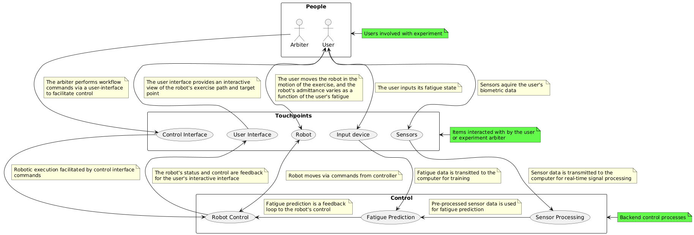

# ROS2 Workspace
This is my (George Kouretas') ROS2 workspace aimed at developing a rehabilitative robotic system using a UR10E robot and real-time biofeedback signals.

## Background
This workspace contains software meant for controlling a prototype rehabilitative exercise system. This system primarily consists of (1) a robotic arm for assistive and resistive feedback, (2) Biometric sensors for feedback acquisition, (3) an embedded input device for recording a user's fatigue state, (4) a predictive model for mapping sensor telemetry to a user's fatigue state, and (5) a decoder for mapping a user's estimated fatigue state to a robotic control signal. 

A high-level view of the system is shown below:


## Setup
This workspace is developed using ROS2 `humble` on Ubuntu 22.04.

To install, follow the provided directions found [here](https://docs.ros.org/en/humble/Installation/Ubuntu-Install-Debs.html).

In addition to the base installation, `ros2_control` is required and can be installed with the following commands:
```bash
$ sudo apt install ros-humble-ros2-control ros-humble-ros2-controllers
$ sudo apt-get install ros-humble-xacro
```

Additionally, the real-time or low latency kernel is recommended to be installed when using the UR driver. Instructions for this can be found [here](https://docs.universal-robots.com/Universal_Robots_ROS2_Documentation/doc/ur_client_library/doc/real_time.html#real-time-setup).


For URSim, docker must be installed (instructions for Ubuntu 22.04 can be found [here](https://www.cherryservers.com/blog/install-docker-ubuntu-22-04)). To set up the URSim, the steps found [here](https://docs.universal-robots.com/Universal_Robots_ROS2_Documentation/doc/ur_robot_driver/ur_robot_driver/doc/installation/ursim_docker.html) may be performed.

## Configuration
To setup the workspace, run the following git command to checkout a branch and update all the active submodules:
```bash
git checkout <branch> && git pull && git submodule update --init --recursive
```

Ethernet settings:
- See [here](./src/Universal_Robots_ROS2_Driver/ur_robot_driver/doc/installation/robot_setup.rst) for pendant/PC configuration
  - Note: there is no need to have other networks (i.e. WiFi) so long as there are no networks conflicts

GPU support
- For GPU support for usage with tensorflow, I followed the following steps [here](https://gist.github.com/pantor/9786c41c03a97bca7a52aa0a72fa9387) to allow for usage with the RT-kernel, which tends to not have inherent compatibility with NVIDIA drivers.

## Build
If not already installed, install colcon for building the workspace with the following command:
```bash
$ sudo apt install python3-colcon-common-extensions
```

From the workspace folder, run the following command to build the complete workspace:
```bash
$ colcon build --symlink-install
$ source install/setup.bash
```
## Submodules
This workspace consists of many submodules (14 in total) that operate together in order to have a complete, yet modular system.

### Custom ROS packages
- [`exercise_decoder_node`](./src/exercise_decoder_node): This module contains ROS nodes meant to decode an external signal into a control signal in the context of exercise control. For example, some nodes exist where the activation of a robot trajectory is controlled by the amplitude of a user's muscle activations (via an EMG) and where a user's reported fatigue state changes the damping factor of the robot in dynamic force control.
- [`fatigue_classifier`](./src/fatigue_classifier/): This module contains a customizable fatigue model interface, as well as a ROS module to process signals in real-time and feed them to a trained model.
- [`fatigue_experiment_control`](./src/fatigue_experiment_control/): This is the central module for integrating all the relevant ROS packages required for fatigue experimentation. It includes a GUI for control, as well as relevant launch files for experimentation.
- [`idl_definitions`](./src/idl_definitions/): This module contains all custom IDL defintions for these packages.
- [`pi_user_input_node`](./src/pi_user_input_node/): This module contains software for controlling the Raspberry Pi for the user input device, as well as publishing telemetry via a ROS node.
- [`ros2_mindrove`](./src/ros2_mindrove/): This module interfaces with Mindrove devices via a wrapper on their public API for streamlined cyclic data collection, as well as a ROS-based publisher for their EMG armband.
- [`ros2_plux_biosignals`](./src/ros2_plux_biosignals/): This module interfaces with the plux biosignals hub via their public API and publishes telemetry via a ROS node.
- [`ur10e_custom_control`](./src/ur10e_custom_control/): This module contains custom scripts, type definitions, and user interfaces to interact with the messages and services provided by the Universal Robot ROS driver for streamlined and simplified control and development. 

### Thirdparty ROS packages
- [`Universal_Robots_Client_Library`](./src/Universal_Robots_Client_Library/): Courtesy of Universal Robots. Used as a client to the driver and as the controller for the robot's communication interface. Some custom control modes were added on top of the thirdparty library.
- [`Universal_Robots_ROS2_Description`](./src/Universal_Robots_ROS2_Description/): Courtesy of Universal Robots. Contains descriptive files and configurations (i.e. urdf's, rviz configuration) for simulation and control of UR robots.
- [`Universal_Robots_ROS2_Driver`](./src/Universal_Robots_ROS2_Driver/): Courtesy of Universal Robots. Contains all software concerning robotic control and telemetry dispatching for UR robots. Some custom control modes and features were added on top of the thirdparty library.
- [`ur_msgs`](./src/ur_msgs/): Courtesy of Universal Robots. This module contains all custom IDL definitions used in UR's repositories.

### Miscellaneous
- [`python_utils`](./python_utils/): This module contains general python utilities. Currently, this workspace uses some ROS utilities, but is relatively under utilized at this point. 
  - NOTE: The shell script [`add_python_utils_symlink.sh`](./add_python_utils_symlink.sh) can be used to add a symlink to the this module within a workspace package (with the symlink assuming that the `python_utils` folder exists at the root of the workspace, as done in this workspace).
- [`python-samples`](./thirdparty/plux/python-samples/): Plux's python API, with included examples. Their API consists of dll bindings, so it is not available to download with PyPi, hence why it is included here.
  - NOTE: this path is referenced by [`ros2_plux_biosignals`](./src/ros2_plux_biosignals/), so its relative location is important.
- [`8821cu-20210916`](./thirdparty/wifi_driver/8821cu-20210916/): Open-source WiFi driver. Used for enabling the external WiFi dongle provided by Mindrove.